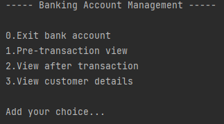
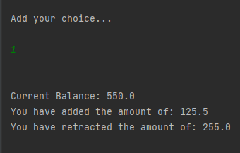
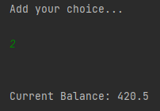
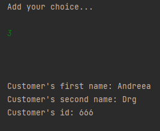
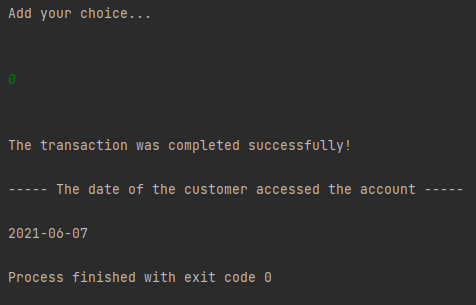

# Banking-Account-Management
Simple bank application using OOP Principles ->  Java
-------------------------------------------------------

The application provides several banking operations, addition, cash withdrawal, customer details, date of accessing the bank account.

The application was implemented using OOP principles, we have a menu where we can choose the desired option (add, extract, view, etc.) in the console.

How to run:
--
1. This is the menu with the available options:

----------------------------------------------

-----------------------------------------------

-----------------------------------------------

---------------------------------------------

